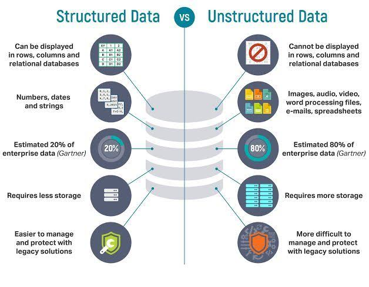

# #01 - Conceitos Básicos

## Dados Estruturados e Não Estruturados

Dados estruturados e não estruturados referem-se a duas formas diferentes de organizar informações.

Os dados estruturados são aqueles que seguem um formato predefinido e organizado. Eles são geralmente armazenados em bancos de dados relacionais e são representados por tabelas com colunas e linhas. Cada coluna corresponde a um atributo específico dos dados, enquanto cada linha representa uma entrada individual. Os dados estruturados são facilmente pesquisáveis, podem ser consultados usando consultas SQL e são adequados para análises e processamento automatizado. Exemplos de dados estruturados incluem registros financeiros, informações de inventário e registros de clientes.

Por outro lado, os dados não estruturados não seguem um formato organizado e não podem ser facilmente armazenados em uma tabela ou banco de dados relacional. Eles são geralmente informações em formato de texto, como documentos, e-mails, mídias sociais, vídeos e imagens. Esses dados não têm uma estrutura fixa e podem conter informações em linguagem natural, tornando-os mais desafiadores de serem analisados e processados por métodos tradicionais. No entanto, com o avanço da tecnologia, técnicas como processamento de linguagem natural e análise de imagem têm sido aplicadas para extrair insights úteis desses dados não estruturados.

É importante destacar que também existem os dados semi-estruturados, que são uma combinação dos dois. Esses dados têm alguma forma de estrutura, mas não são totalmente rígidos como os dados estruturados. Exemplos de dados semi-estruturados incluem arquivos XML e JSON, onde a estrutura é definida, mas alguns elementos podem ser opcionais ou ter valores variáveis.

Em resumo, os dados estruturados são organizados e seguem um formato predefinido, enquanto os dados não estruturados não têm uma estrutura fixa e são mais difíceis de serem processados. Ambos os tipos de dados têm suas vantagens e desafios, e a análise de ambos pode fornecer insights valiosos para as organizações.

---

## Dataframe e Series

No Pandas, um DataFrame é uma estrutura de dados tabular bidimensional. Pode ser visto como uma tabela com colunas e linhas, semelhante a uma planilha ou uma tabela SQL. Cada coluna em um DataFrame representa uma variável específica, enquanto cada linha representa uma observação ou registro. O DataFrame é flexível e pode conter diferentes tipos de dados em cada coluna.

Uma Series, por outro lado, é uma estrutura de dados unidimensional fornecida pelo Pandas. É semelhante a um array unidimensional ou uma coluna em uma planilha. Uma Series contém uma sequência de valores e um índice associado a cada valor, que fornece uma identificação única para acessar os dados. A Series é geralmente usada para representar uma única variável ou uma única coluna de um DataFrame.

Tanto o DataFrame quanto a Series oferecem funcionalidades poderosas para manipulação, análise e processamento de dados. O Pandas fornece um conjunto abrangente de funções e métodos para realizar tarefas como filtrar dados, agregar informações, calcular estatísticas, combinar dados de diferentes fontes, entre outros. Essas estruturas de dados são amplamente utilizadas na análise de dados e cientistas de dados, pois fornecem uma maneira eficiente de trabalhar com conjuntos de dados de forma intuitiva e flexível.

---

## Variaveis Dependentes e Indepedentes

Variáveis dependentes e independentes são conceitos fundamentais na análise estatística e modelagem de dados.

Uma variável dependente é aquela que é afetada ou influenciada por outras variáveis. É a variável que estamos interessados em estudar ou prever. Ela é também chamada de variável de resposta ou variável alvo. Em um experimento ou estudo, a variável dependente é aquela que observamos e medimos para analisar o efeito das variáveis independentes sobre ela. Por exemplo, se estamos estudando o efeito de diferentes doses de um medicamento (variáveis independentes) no tempo de recuperação de um paciente (variável dependente), o tempo de recuperação seria a variável dependente.

Por outro lado, as variáveis independentes são aquelas que são manipuladas ou controladas no estudo. Elas são chamadas de variáveis independentes porque supostamente não são influenciadas por outras variáveis do estudo. Essas variáveis são escolhidas e manipuladas pelo pesquisador para entender como elas afetam ou influenciam a variável dependente. No exemplo mencionado anteriormente, as diferentes doses de medicamento seriam as variáveis independentes.

A relação entre as variáveis independentes e dependentes é o foco da análise estatística. Os pesquisadores usam técnicas estatísticas para identificar e quantificar a relação entre essas variáveis. Isso pode incluir análises de correlação, regressão, testes de hipóteses, entre outros métodos estatísticos.

Em resumo, a variável dependente é aquela que é afetada ou influenciada pelas variáveis independentes. A variável dependente é a variável que estamos interessados em estudar ou prever, enquanto as variáveis independentes são aquelas que manipulamos ou controlamos para entender seu efeito na variável dependente.

---

## Terminologia Populacao e Amostragem - Estatistica VS Ciencias de Dados 

Embora os termos "população" e "amostragem" sejam usados tanto em estatística quanto em ciência da computação, eles podem ter significados um pouco diferentes dependendo do contexto.

#### Em Estatística:

* População: 

Refere-se ao conjunto completo de todos os elementos relevantes para um estudo estatístico. Pode ser um grupo de pessoas, objetos, eventos, resultados de experimentos, entre outros. A população é o universo que estamos interessados em estudar e fazer inferências.

* Amostragem: 

É o processo de seleção de um subconjunto representativo da população para coleta e análise de dados. A amostragem permite obter informações sobre a população maior sem a necessidade de analisar todos os elementos. É importante garantir que a amostra seja representativa da população para obter resultados confiáveis.

#### Em Ciência da Computação:

* População: 

Pode se referir a um conjunto de dados ou entidades em um sistema computacional. Por exemplo, a população de usuários de um aplicativo, a população de documentos em um banco de dados, etc. Em geral, é um grupo ou conjunto de elementos que podem ser processados ou analisados por um sistema computacional.

* Amostragem: 

Também pode ser usado no contexto de processamento de dados em ciência da computação, mas com um significado ligeiramente diferente. A amostragem pode se referir ao processo de selecionar uma parte dos dados para análise ou teste, especialmente quando se trata de grandes volumes de dados. Isso é comum em algoritmos de aprendizado de máquina, onde uma amostra dos dados é usada para treinamento e teste de modelos.

Em resumo, embora os termos "população" e "amostragem" sejam usados em estatística e ciência da computação, eles podem ter interpretações ligeiramente diferentes em cada campo. Em estatística, eles se referem ao universo de estudo e à seleção representativa de um subconjunto para análise. Em ciência da computação, eles podem se referir a conjuntos de dados ou entidades em sistemas computacionais e ao processo de seleção de uma parte dos dados para processamento ou análise.

---