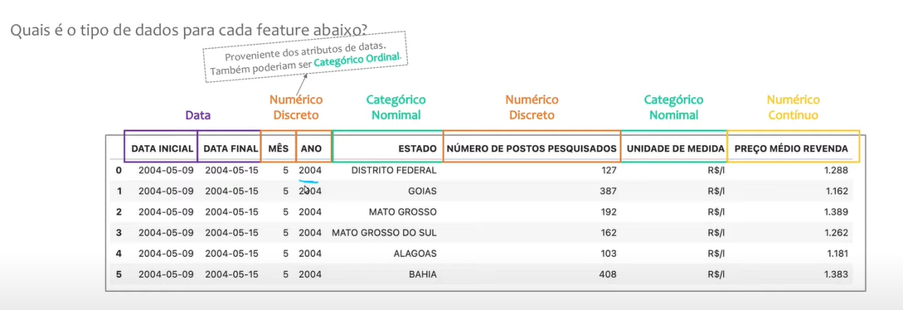

# #02 Tipos de Variáveis

## Tipos de Dados 

Os dados podem ser categorizados em dois tipos principais: numéricos (quantitativos) e categóricos (qualitativos).

Dados numéricos ou quantitativos são aqueles que representam uma quantidade mensurável ou um valor numérico. Esses dados são expressos por meio de números e podem ser subcategorizados em dados contínuos e discretos:

* Dados numéricos contínuos: 

São valores que podem assumir qualquer valor dentro de um intervalo. Por exemplo, a altura de uma pessoa, o tempo decorrido, a temperatura. Esses dados são geralmente representados por números reais.

* Dados numéricos discretos: 

São valores que são contáveis e representam uma quantidade específica. Por exemplo, o número de filhos de uma família, o número de páginas de um livro, o número de pessoas em uma sala. Esses dados são geralmente representados por números inteiros.

Por outro lado, os dados categóricos ou qualitativos são aqueles que representam características ou qualidades. Esses dados não são expressos numericamente, mas sim em categorias ou rótulos. Os dados categóricos podem ser subcategorizados em duas formas:

* Dados categóricos nominais: 

Representam categorias que não têm uma ordem ou hierarquia específica. Por exemplo, a cor dos olhos (azul, verde, castanho), o gênero (masculino, feminino, não binário), a raça (branco, preto, asiático).

* Dados categóricos ordinais: 

Representam categorias com uma ordem ou hierarquia específica. Por exemplo, a classificação de satisfação do cliente (muito satisfeito, satisfeito, insatisfeito), a escala de avaliação de dor (leve, moderada, intensa).

Essa distinção entre dados numéricos e categóricos é importante para determinar o tipo de análise estatística apropriada para aplicar aos dados, bem como as técnicas de visualização e interpretação adequadas

---

## Casos Especiais

### Variáveis Discretas tratadas como Variáveis Contínuas

O **dinheiro** ou o preço de algo varia em passos de 1 centavo, então é uma **variável discreta**.

Porém, se você está com **centenas de Reais**, os **passos são tão pequenos** que ele pode ser tratado como uma **variável contínua**.

---

### Variáveis Categóricas representadas com Números

Variáveis categóricas podem ser representadas com números para facilitar o armazenamento e análise dos dados. Existem duas formas comuns de representação: codificação numérica simples e codificação numérica ordinal. Na codificação simples, atribuímos números arbitrários às categorias. Na codificação ordinal, os números refletem uma ordem ou hierarquia das categorias. É importante lembrar que os números atribuídos não possuem significado intrínseco além de representar diferentes categorias, e eles não devem ser interpretados como medidas quantitativas. A representação numérica ajuda no processamento e na aplicação de técnicas estatísticas aos dados categóricos.

*Exemplo*

Escala de Satisfação do Cliente

0 - Péssimo

1 - Ruim

2 - Bom

3 - Exelente

---